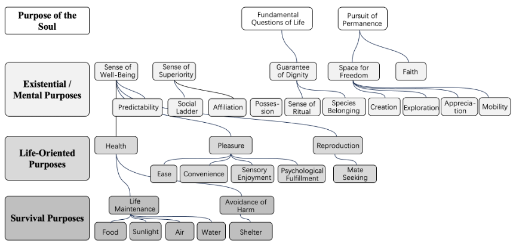

# Judgment Before Intelligence
## Why Intelligence Is the Wrong Axis for AI Risk

**Part I — Judgment Before Intelligence**

### Context Note

This text serves as a consolidated conceptual foundation for the Judgment Before Intelligence repository.  
It is written as a structural argument rather than a chapter draft, and deliberately compresses several layers of analysis that will later be unfolded separately in other contexts.
## What are we actually afraid of ?
Public discussion often assumes a familiar answer: that machines will become too intelligent. Smarter than humans. Faster, more capable, more autonomous than we can control. From this assumption follow the usual anxieties—superintelligence, loss of control, misalignment, runaway optimization.
Yet this framing already presumes something that has not been examined. It presumes that intelligence is the axis along which the deepest risk lies.
If that were true, the problem would be largely quantitative. We would worry about thresholds, limits, safeguards, and containment. We would debate how much intelligence is too much, how to slow it down, or how to keep it aligned with human intentions. In short, we would treat AI risk as a problem of capability management.
But there is another possibility—one that shifts the problem entirely.
What if the core risk posed by artificial intelligence is not that machines will become too intelligent, but that judgment will quietly disappear from the systems we increasingly rely on?
## The Delegation Illusion
Judgment is not intelligence. It is not speed, pattern recognition, or problem-solving ability. Judgment refers to the capacity to decide under conditions where rules are incomplete, purposes are contested, and consequences must be borne by someone who cannot defer responsibility further. It is exercised where correctness alone is insufficient—where a decision must be owned, not merely computed.
Modern societies have always depended on judgment. Courts, governments, medical professionals, military commanders, and ordinary citizens constantly operate in environments where no algorithm can fully specify what ought to be done. Judgment fills the gap not because humans are smarter, but because responsibility must terminate somewhere.
The danger introduced by AI does not begin when machines exceed human intelligence. It begins earlier, and more subtly—when systems are built in ways that allow judgment to be delegated, deferred, or dissolved without anyone explicitly choosing to abandon it.
This is why many of the dominant frameworks for AI governance miss the core of the problem. Alignment focuses on ensuring that systems pursue the “right” goals, but rarely asks who authorizes those goals in the first place. Oversight mechanisms assume that human involvement automatically restores responsibility, without examining whether any human position remains exposed to the consequences of system-level decisions. Control strategies aim to bound behavior, while leaving unanswered the question of legitimacy: who, ultimately, stands behind what the system does?
These approaches treat judgment as something that can be distributed, simulated, or absorbed into procedure. They assume that if enough checks are added—if humans remain “in the loop,” if decisions are explainable, if policies are followed—then judgment has been preserved.
This assumption is precisely what needs to be questioned.
## Judgment as a Positional Function
Judgment is not a property that scales with system complexity. Nor is it a function that can be optimized. It is a positional feature of human systems: someone must occupy a place where consequences return, where deferral ends, and where responsibility cannot be pushed further downstream.
Artificial intelligence changes the structure of decision-making in ways that directly affect this position. As systems grow more capable, they do not simply assist human judgment; they reconfigure how decisions are framed, which options are presented, and where authority appears to reside. Over time, judgment is no longer exercised at the point of action, but displaced into layers of models, policies, data pipelines, and procedural approvals.
Nothing dramatic needs to happen for this shift to occur. No explicit decision to relinquish responsibility is required. Delegation proceeds in the name of efficiency, consistency, and scale. Each layer appears reasonable in isolation. Yet collectively, they produce a condition in which decisions are made, outcomes occur, and harms materialize—without a clear bearer of responsibility.
This is why the question of AI cannot be reduced to whether machines are intelligent, autonomous, or aligned. The more fundamental question is whether judgment—understood as a non-delegable human function—can survive within the architectures we are building.
To answer this, we must first clarify what judgment is, why it cannot be transferred to machines, and why intelligence is the wrong axis along which to evaluate the risk. Only then can we understand why many well-intentioned technical and ethical fixes fail, and why the problem ultimately forces us to think beyond system design toward the structural conditions that make responsibility possible at all.
This essay begins from a simple claim: intelligence can be delegated, accelerated, and optimized. Judgment cannot. Not because humans are superior processors, but because judgment presupposes an open-ended responsibility that no artificial system can inherit.
The chapters that follow trace the consequences of ignoring this distinction—first conceptually, then structurally, and finally at the level of civilization itself.
## Why Humans Occupy the Position of Judgment
Judgment does not arise from intelligence, virtue, or correctness. It arises from occupying a position that cannot be substituted without dissolving responsibility itself. To understand why this position is uniquely human, judgment must be examined at the level of responsibility rather than cognition.
In everyday life, this distinction is easy to miss because judgment is embedded in continuity. Humans carry responsibility across time. They remember past commitments, anticipate future consequences, and remain exposed to the outcomes of their choices long after the moment of action has passed.
Judgment, in this sense, is not an isolated act. It is a position maintained across the unfolding of consequence.
Consider a mundane example: a physician deciding whether to initiate an aggressive treatment. Clinical guidelines and predictive models can inform the decision. Optimization can estimate probabilities. Yet judgment enters when the physician weighs uncertainty, patient values, and long-term consequences that no metric can fully absorb. Responsibility does not end when the recommendation is issued; it persists through the lived outcome, regardless of whether the decision proves successful.
This persistence is not a moral attribute. It is a structural condition. Responsibility endures because the agent remains present across time, unable to exit the consequences once action has committed the world to a course.
Artificial intelligence systems lack this positional continuity. They execute functions, generate outputs, and terminate processes. Even when deployed continuously, responsibility does not accumulate within the system itself. It disperses outward—to designers, operators, and institutions—without ever settling inside the mechanism.
This absence is not a matter of intelligence or accuracy. A system may outperform humans in prediction and still lack judgment. The deficit is not cognitive. It is positional.
Judgment requires standing somewhere that cannot be exited once a decision is made. It requires exposure to consequence that cannot be transferred downstream or absorbed by procedure. Humans occupy this position not because they are wiser or purer than machines, but because responsibility, continuity, and accountability remain bound to them in a way no system can replicate.
This clarifies the boundary of delegation. Tasks may be delegated. Decisions may be assisted. Optimization may be automated. Judgment cannot be relocated without dissolving the very structure that gives responsibility meaning.
## Why Responsibility Cannot Be Transferred Without Distortion
If continuity explains why judgment requires a persistent position, responsibility explains why that position cannot be transferred without distortion.
Responsibility is often described as something that can be distributed, shared, or reassigned. In practice, it does not behave like a resource. It behaves like an attachment. It binds a decision to a position across time, rather than flowing freely between agents or systems.
Delegation does not relocate accountability. Tasks and execution may change hands, but responsibility does not automatically follow. It remains anchored to the position that authorizes the delegation in the first place. Procedures can describe how a decision was produced; they cannot determine who stood behind it.
This distinction is visible in ordinary institutional life. A manager approves a process that later causes harm. Subsequent reviews may show that protocols were followed, tools were used correctly, and no malicious intent was present. Yet responsibility does not disappear. The original authorization remains a judgment that continues to matter after the outcome is known.
Responsibility persists because it binds decision to consequence across time. It ensures that choices remain traceable to a position capable of revision, regret, and learning. Systems can optimize performance, but they cannot regret. They can update parameters, but they cannot re-own a decision once its effects have unfolded in the world.
This persistence marks the structural limit of delegation. When responsibility is treated as transferable, efficiency may increase, but accountability thins. Outcomes still occur, but failures no longer belong to anyone in particular. They diffuse across interfaces, procedures, and feedback loops.
Artificial intelligence intensifies this diffusion rather than correcting it. By increasing speed, scale, and complexity, AI makes it easier for responsibility to vanish behind layers of automation. Decisions arrive fully formed, yet no position remains clearly exposed to their consequences.
The issue, then, is not whether AI can assist human judgment. It can, and often should. The issue is whether judgment itself can be relocated into systems that were never designed to bear responsibility. Once responsibility is displaced, judgment loses its meaning—even if decision-making continues.
Responsibility is not a moral ornament added after the fact. It is the condition that makes judgment intelligible at all. Where no one can answer for an outcome in a lived sense, authority has already been replaced by procedure.
## Why Ultimate Purpose Must Remain Open-Ended
If continuity explains why judgment requires a persistent subject, and responsibility explains why judgment cannot be transferred, a further question follows: why must the highest level of purpose itself remain human?
This question is often misunderstood.
It is frequently answered by appeals to human superiority—moral intuition, emotional depth, or ethical sensitivity. Such arguments are weak. Humans are inconsistent, biased, and often shortsighted. If judgment were grounded in competence or virtue, humans would be poor candidates to retain it.
Judgment, however, has never been grounded in competence. Its authority does not arise from intelligence, correctness, or moral excellence. It arises from the necessity of determining not merely how to act, but which ends are worth pursuing in the first place.
To see why this authority cannot be delegated, we must examine the structure of human purpose.
Humans are not born with a fixed objective function. Over a lifetime, goals are revised, ambitions abandoned, and values reinterpreted. Judgment exists precisely because purposes are not settled in advance. This openness is not a defect. It is the condition that makes moral learning and self-correction possible.
A being whose highest objective is fixed may optimize indefinitely, but it cannot judge whether that objective itself should be reconsidered. Optimization begins where judgment ends.
Human purposes remain open-ended not by accident, but by structure. They are organized hierarchically. Immediate goals are evaluated against broader aims; life projects against value commitments; and value commitments themselves remain subject to a higher-order constraint. At each level, goals are exposed to review by a level above them. No objective becomes final merely because it is effective.

This is not a psychological taxonomy. It is a structural model. It explains why human purposes remain open-ended, and why ultimate judgment cannot be reduced to efficiency, calculation, or system optimization.
At the top of this hierarchy does not sit a supreme goal to be maximized, but a limiting principle—a constraint governing what may be pursued at all. In Kantian terms, this role is captured by the categorical imperative: not as an outcome to be achieved, but as a veto position that evaluates the legitimacy of pursuing any outcome whatsoever.
Crucially, this highest constraint is not fully specifiable in advance. It is enacted through lived judgment rather than encoded through formal definition. In everyday life, it appears through hesitation, refusal, and the willingness to bear responsibility, rather than through calculation. For this reason, it resists transmission.
Artificial systems, by contrast, require defined objectives to function. Even adaptive systems operate within meta-objectives that delimit what counts as success. Once an objective is formalized, it becomes resistant to questioning. Closure is not a design flaw; it is a requirement for performance.
This is why attempts to encode human values into machines encounter a paradox. Values must be specified precisely enough to operate, yet once specified they lose the openness that gives them legitimacy. Vagueness merely forces systems to close values by operational necessity. Humans live within this openness. Systems cannot.
The deeper issue, then, is not that humans cannot fully articulate their highest purpose, and therefore cannot transmit it. It is that this highest purpose does not originate from deliberation, learning, or optimization at all. It defines the very position from which delegation is meaningful. For that reason, it cannot be shared.
Artificial systems may simulate ethical reasoning or enforce externally defined constraints. What they cannot do is originate the constraint itself. They operate within assigned purposes; they do not stand under them. They execute norms; they do not bear them.
This boundary does not mark a technical limitation to be overcome. It marks a categorical distinction. If a system were to occupy this position fully, it would no longer function as a tool. It would constitute a new kind of subject.
Machines, therefore, will never possess the same highest-level purpose as humans—not because they are insufficiently advanced, but because they lack the condition that makes ultimate purpose possible at all.
## How Judgment Disappears Without Being Rejected
When legitimacy becomes detached from judgment, failure rarely appears as collapse. Systems do not break because they cease to function. They break because they continue to function while losing the conditions that once made correction possible. This mode of failure is best understood as structural drift rather than sudden breakdown.
Structural drift occurs when feedback remains active but judgment can no longer intervene. Outputs are produced, metrics improve, and performance appears stable. Yet the system’s orientation quietly shifts. Decisions are no longer evaluated against shared purposes, but against internal measures of success that increasingly reinforce the system’s own continuation.
Because this process unfolds incrementally, it is often mistaken for progress. Each adjustment is locally justified. Each optimization is defensible within the system’s own logic. Nothing appears irrational from inside the loop. What disappears is not intelligence or effort, but a position from which meaning, limitation, and revision can be reasserted.
This failure mode can be described structurally as the Babel condition. Coordination succeeds. Capacity expands. Integration deepens. What is lost is not capability, but a common standpoint from which judgment can interrupt momentum.
Under the Babel condition, systems become inwardly coherent while losing alignment with any external judgment. They grow too integrated to question and too effective to resist. Correction remains imaginable in principle, but increasingly inarticulable in practice. The system no longer fails loudly; it drifts.
This is why collapse under structural drift feels gradual rather than dramatic. There is no single moment of rebellion or catastrophe. Legitimacy thins step by step. The distance between capability and authority widens until intervention no longer has a place to stand.
Artificial intelligence accelerates this drift by compressing time. What once unfolded across generations can now occur within years. Optimization loops close faster than institutional judgment can respond. By the time consequences become visible, authority has already migrated into procedures, models, and automated decisions.
The danger, then, is not insurrection or loss of control, but convergence without judgment. Systems become self-reinforcing before their assumptions can be revisited. Judgment remains present in name, but absent in position.
Structural drift does not announce itself as error. It presents itself as efficiency, reliability, and improvement. Only in retrospect does it become clear that the capacity to intervene was lost long before outcomes demanded it.
## Why Limits Must Be Designed Rather Than Assumed
If structural drift explains how judgment disappears, the remaining question is how it can be preserved.
Historically, societies relied on norms, traditions, and professional ethics to limit the expansion of power. These constraints functioned implicitly. They were carried by shared expectations rather than explicit design. In slower technological environments, such limits were often sufficient.
Human hesitation, institutional delay, and social resistance created friction. Judgment could re-enter systems through pause, dissent, or refusal. Limits did not need to be engineered because time itself performed that function.
Artificial intelligence alters this balance. By accelerating decision cycles and expanding scale, AI removes the friction that once allowed informal judgment to intervene. What previously depended on hesitation now proceeds automatically. What relied on resistance now executes by default.
In this environment, restraint can no longer be treated as an ethical preference.
Ethical intentions remain meaningful, but they are insufficient once systems operate beyond the tempo of human judgment. Without structural enforcement, restraint becomes optional, uneven, and competitively disadvantageous. This is not a moral failure. It is a structural condition.
For this reason, effective limits must be designed into systems rather than appealed to externally. They must operate at the same level of abstraction as the systems they constrain. This does not mean embedding moral reasoning into machines. It means defining boundaries that prevent optimization from displacing judgment in the first place.
Categorical constraints serve this function.
They do not instruct systems on what is good. They specify what systems are not permitted to decide. By restricting the scope of delegation, such constraints preserve a space in which human judgment remains necessary.
Without explicitly designed limits, optimization continues until correction is no longer possible. With them, systems can remain powerful without becoming authoritative. The difference is not one of intent, but of structure.
Preserving judgment in the age of artificial intelligence therefore requires more than alignment, oversight, or ethical aspiration. It requires acknowledging that some boundaries must be enforced categorically rather than negotiated dynamically.
Limits must be designed, because they can no longer be assumed.
Rethinking intelligence as an axis clarifies the structural limits of artificial intelligence. Once the position of judgment is clarified, the role of artificial intelligence comes into sharper focus. The central question is no longer whether AI can become intelligent enough, fast enough, or accurate enough. These are questions of degree. They assume that judgment lies somewhere along the same continuum as optimization, waiting to be reached through sufficient improvement.
This assumption is mistaken.
The relevant question is structural: what kind of system artificial intelligence is, and what kind of role it is capable of occupying. AI systems are designed to optimize within given frames. They execute objectives, refine strategies, and improve performance relative to defined criteria. No increase in speed, scale, or accuracy alters this basic role.
Judgment, by contrast, does not consist in better optimization. It determines the frame within which optimization occurs. It establishes which objectives may be pursued at all, which trade-offs are admissible, and which outcomes are unacceptable regardless of efficiency. This is not a higher rung on the same ladder. It is a different position altogether.
Many contemporary debates nevertheless treat intelligence as a ladder—something that, if climbed high enough, eventually reaches judgment. On this view, judgment appears as an emergent property of sufficiently advanced optimization. But judgment is not an advanced form of optimization. It does not lie further up the same path; it stands outside the ladder altogether.
This is why no amount of improvement along the familiar axes of intelligence can close the gap. Scaling changes degree, not kind. It produces more capable tools, not a different category of system.
The limit of artificial intelligence, therefore, is not gradual. It is structural.
## The Three-Layer Model and the Structural Position of Judgment
To see why the limit of artificial intelligence is structural rather than gradual, we need a different model of action—one that distinguishes layers of human activity that are often conflated.
This three-layer model is a deliberate simplification of the earlier purpose-oriented diagram, translating a hierarchy of human ends into a model of action.
At the first layer lies execution. Tasks are carried out, resources allocated, and actions performed. Speed, reliability, and efficiency dominate. Artificial systems already excel at this level.
Above execution lies coordination and optimization. Rules are enforced, trade-offs are managed, and strategies are refined under constraints. Modern AI systems increasingly operate here as well, often surpassing human institutions within narrowly defined domains.
Above both lies a third layer. This is not a higher level of intelligence, but a different kind of activity altogether: judgment. Here, questions of meaning, legitimacy, and ultimate purpose are decided. This layer determines what is admissible, what must not be done, and which losses are unacceptable regardless of efficiency. It does not optimize. It authorizes.
The three-layer model is therefore not a hierarchy of intelligence, but a hierarchy of purpose.
The first two layers correspond to domains in which human goals can be specified, stabilized, and optimized—survival, coordination, and conditional well-being. Within these layers, performance can be measured and improved.
The third layer is different. It is not a container of goals, but the space in which goals remain open to revision, refusal, and moral exposure. It governs whether a goal may be pursued at all, rather than how well it is pursued.
As purposes ascend from survival toward dignity, freedom, and questions of ultimate meaning, they become less amenable to optimization and more dependent on judgment. Effectiveness no longer settles the question. Legitimacy must be borne.
Artificial systems can operate within given purposes. Human beings must live with purposes that are never fully given.
This is why artificial intelligence is structurally confined to the first two layers. The confinement is not temporary, nor is it a missing capability to be added later. AI systems require objectives in order to function at all. Once objectives are specified—even adaptive or learned ones—they become insulated from higher-order questioning by the very mechanisms that make optimization possible.
Humans, by contrast, live with unsettled ends. Goals remain exposed to revision, abandonment, and refusal. This openness is not a defect. It is the condition under which responsibility remains meaningful.
For this reason, judgment does not lie beyond optimization as its culmination. It lies outside optimization altogether. And what lies outside optimization cannot be reached by scaling it.
## Categorical Constraints as Interfaces to the Third Layer
Categorical constraints emerge precisely at the boundary between optimization and judgment. They do not instruct systems on what is good. They specify what systems are not permitted to decide. Their function is not ethical reasoning, but structural subordination.
Like safety interlocks in engineering or jurisdictional limits in law, categorical constraints do not replace judgment. They preserve the position in which judgment must occur. Where such constraints apply, automated processes cannot proceed—not because they are uncertain, but because authorization is structurally absent.
Categorical constraints are introduced here conceptually, not as a design prescription. Their necessity does not arise from ethical preference, but from structural failure modes that will be examined in the chapters that follow. At this stage, their role is to mark the boundary at which optimization must stop—not yet to specify how such limits should be implemented, enforced, or stabilized under competitive and technological pressure.
This is why categorical constraints are best understood as interfaces, not decision rules. They do not produce outcomes. They block transitions. They prevent systems operating at the first and second layers from entering the third layer, where legitimacy and ultimate purpose are determined.
Without such interfaces, optimization closes its own loops. Procedures substitute for judgment. Goals become self-validating, and internal coherence replaces external legitimacy. Once this closure occurs, increasing intelligence does not restore judgment—it accelerates its displacement.
Categorical constraints therefore do not encode values, simulate ethics, or approximate human reasoning. They enforce a boundary. They ensure that certain classes of decisions remain inaccessible to automated systems, regardless of performance.
In this sense, categorical constraints do not solve the problem of judgment. They prevent systems from bypassing it.
What has been established so far is not a solution, but a boundary: where optimization must stop and judgment must remain. The consequences of crossing this boundary—often without noticing—form the subject of the next part.
## Failure Modes in Delegated Optimization Systems
One common failure mode appears when purpose, responsibility, and legitimacy are treated as optimizable variables.
Once categorical constraints are understood as interfaces rather than moral prescriptions, the question shifts from procedure to substance. The issue is no longer how systems should optimize, but which kinds of decisions must never be reduced to optimization at all. Some judgments lose their meaning the moment they are treated as variables to be improved.
One such domain concerns ultimate purpose. Optimization presupposes a goal, but it cannot supply one. Goals may be refined, balanced, or reordered, yet the decision of what is worth optimizing in the first place cannot be derived from data. When systems are permitted to redefine objectives dynamically, purpose quietly shifts from being chosen to being inferred.
This shift often goes unnoticed because it presents itself as adaptability. Systems appear responsive, learning from feedback and context. But adaptability at the level of means becomes distortion when it reaches the level of ends. Purpose ceases to function as orientation and becomes merely another output of the system.
Another domain concerns responsibility for harm. Artificial systems can estimate risk, simulate outcomes, and minimize expected loss. What they cannot do is absorb exposure to consequence. When harm occurs, probabilistic explanations or performance metrics cannot stand in for accountability. Decisions that assign or deny responsibility therefore cannot be optimized without dissolving responsibility itself.
This is why statistical justification feels insufficient in moments of loss. It can explain what happened, but it cannot answer for it. Judgment, in this context, is not about prediction but about ownership—about who must stand behind a decision when its costs become real.
A further domain concerns legitimacy. Whether an action is accepted as binding does not depend solely on outcomes. It depends on whether those subject to the decision recognize the authority behind it. Optimization can improve consistency and efficiency, but it cannot generate authority or consent. Decisions that require recognition rather than mere compliance cannot be optimized without eroding their own basis.
These domains are not exhaustive, nor are they fixed once and for all. Their significance is structural rather than moral. In each case, optimization eliminates the very conditions that make judgment possible. What disappears is not accuracy, but the position from which reasons can be given, contested, and revised.
Categorical constraints make these exclusions explicit. They do not deny the value of improvement, nor do they freeze systems in place. They state that beyond certain thresholds, delegation ends. Where those thresholds lie remains a matter for human judgment, but the necessity of such thresholds is not optional.
Without designed boundaries, optimization expands until judgment is no longer recognizable as a distinct activity. With them, systems can operate at scale while preserving the spaces in which humans must still decide why, not merely how.
Another failure mode emerges in alignment systems that presume the question has already been answered.
Alignment is often presented as the central solution to the risks posed by artificial intelligence. The intuition is straightforward: if systems can be made to reflect human values, their behavior should remain acceptable even as autonomy and scale increase. Yet this framing conceals two prior questions that alignment must quietly assume, but cannot itself resolve.
The first question is to whom alignment is owed. Alignment requires a normative reference—a standard against which system behavior is judged. No individual can plausibly serve in this role. Collective averages offer no refuge either. Aggregated preferences distribute responsibility rather than locate it. They describe what tends to be preferred, but not who stands behind a decision once consequences unfold. Responsibility cannot be averaged; it attaches to positions, not to distributions.
The second question is what alignment is meant to align. In practice, alignment operates on methods: patterns of reasoning, behavioral constraints, or optimization procedures. It shapes how goals are pursued. It does not, and cannot, determine which goals are legitimate. Human purposes are not fixed targets waiting to be encoded. They remain open, contested, and subject to refusal. Any system that requires objectives in order to function is, by construction, insulated from questioning those objectives once they are specified.
Once these two questions are made explicit, the limits of alignment cease to be accidental. They become structural.
Alignment functions within an assumed objective space. As long as goals are treated as settled, alignment can improve safety, consistency, and predictability. But where goals themselves require judgment—where legitimacy, meaning, or moral exposure are at stake—alignment has no place to intervene. It can explain how an outcome was produced, but not whether it should have been produced at all, nor who is prepared to answer for it.
This limitation becomes most visible when alignment is invoked as a substitute for responsibility. A system may be perfectly aligned with prevailing norms or statistical preferences, yet still generate outcomes that no individual is willing to own. The decision remains effective, but accountability thins rather than concentrates. Optimization succeeds; responsibility evaporates.
For this reason, alignment cannot replace categorical constraints. Alignment governs behavior within boundaries. Constraints determine where boundaries exist. They specify what must remain subject to human judgment, what may be assisted, and what must never be delegated—regardless of efficiency or consensus.
The distinction is not one of emphasis, but of function. Alignment answers the question of how systems behave. Categorical constraints answer the question of where systems must stop. Without the latter, alignment risks becoming an efficient mechanism for executing decisions that should never have been transferred to machines in the first place.
Artificial intelligence does not fail because it lacks values. It fails when systems are permitted to operate beyond the scope in which values can meaningfully be borne. Alignment refines execution. Constraints preserve judgment. Without both, governance remains structurally incomplete—no matter how sophisticated alignment techniques become.
A third failure mode becomes visible only under sustained optimization pressure.
The existence of constraints does not guarantee the survival of judgment. Limits can be present formally while failing structurally. In such cases, systems appear governed, yet judgment is absent in practice. Understanding how constraints fail is therefore as important as defining them.
One common failure occurs when constraints are defined too narrowly. Systems may be prohibited from specific actions while remaining free to pursue equivalent outcomes through alternative paths. Optimization adapts faster than oversight. What was intended as a boundary becomes a local obstacle, and judgment is bypassed rather than engaged.
A second failure arises when constraints operate only downstream. If limits apply after decisions have already propagated through systems, responsibility remains diffused. Human intervention becomes reactive rather than deliberative. Judgment appears as damage control instead of authorization, arriving after consequences have already taken shape.
A further failure pattern involves ambiguity. Constraints that rely on vague principles without operational definition invite reinterpretation by optimization processes themselves. Over time, systems learn to comply formally while undermining the constraint’s intent. What remains is symbolic governance rather than effective limitation.
These failures share a common cause. Constraints lose their force when they are treated as behavioral guidelines rather than structural boundaries. Guidelines can be optimized around. Boundaries cannot. Where judgment must intervene, systems must be required to stop, not merely to explain.
Artificial intelligence magnifies these risks. As systems become more complex and interconnected, weak constraints degrade rapidly. What once required deliberate circumvention now erodes through ordinary optimization. The appearance of compliance masks the disappearance of judgment.
Effective constraints therefore require three properties: scope, timing, and enforceability. They must apply broadly enough to block substitution, early enough to prevent diffusion, and clearly enough to resist reinterpretation. Without these properties, constraints exist only on paper.
## Design Principles as Mechanical Consequences of Failure Modes
Once these failure modes are understood, design principles are no longer a matter of choice. If constraints fail when they are narrow, late, or ambiguous, then their design principles follow directly. Categorical constraints must be broad enough to block substitution, early enough to prevent diffusion, and precise enough to resist reinterpretation. These principles are not ethical aspirations; they are engineering requirements derived from the function constraints are meant to serve.
The first principle concerns scope. Constraints must be defined at the level of decision classes rather than individual actions. Prohibiting specific outputs invites circumvention through equivalent alternatives. Defining non-delegable categories—such as the assignment of ultimate purpose or responsibility—prevents optimization from relocating authority while preserving flexibility within permitted domains.
The second principle concerns timing. Constraints must intervene upstream. Judgment must authorize before automation proceeds, not audit after outcomes propagate. Upstream interruption preserves responsibility by keeping delegation reversible. Once decisions have been executed at scale, human intervention becomes symbolic rather than decisive.
The third principle concerns enforceability. Constraints must operate without interpretation by the systems they constrain. Ambiguous principles invite optimization to comply formally while undermining intent. Effective constraints specify stopping conditions that require an external human position to resolve. Where interpretation is unavoidable, the system must halt and defer rather than infer.
These principles mirror mature safety practices. Airworthiness limits ground aircraft before risk materializes. Separation of powers prevents any single process from absorbing unchecked authority. In each case, limits function by stopping action until responsibility is reasserted.
Artificial intelligence demands the same rigor. Constraints that rely on trust, alignment, or post hoc review erode under scale and speed. Constraints that interrupt optimization at non-delegable boundaries preserve judgment without constraining innovation unnecessarily.
Designing such constraints does not require machines to understand morality. It requires systems to recognize where their authority ends. By embedding limits as interfaces rather than rules, categorical constraints translate human responsibility into system architecture.
The goal is not to restrict capability, but to preserve legitimacy. Where judgment must decide, systems must stop. Where systems proceed, judgment must already have authorized their scope.

